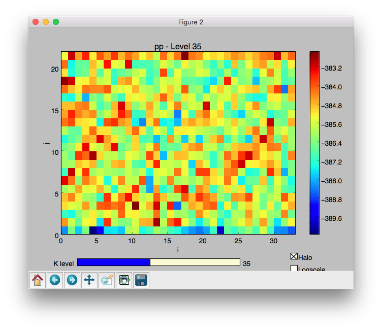

# SerialBox Python Tools

This folder contains the SerialBox python tools. 

- `pp_ser.py` - the SerialBox preproccessor to add the serialization directives to a Fortran program. For documentation see the docs folder. 
- `serialbox` - the SerialBox python module that allows de-serializing and visualizing data stored by SerialBox
- `test.py` - contains the unittests for the Python Tools

## The `serialbox` Python Module

The serialbox python module makes use of the C++ SerialBox wrapper to read serialized data written by SerialBox. For convenience the required dynamic library is distributed with an installation of SerialBox. 

### Installation

Build SerialBox as per the installation and building instructions. CMake installs the serialbox module to 
`$CMAKE_INSTALL_PREFIX/python/serialbox` with `make install` in the build directory.

To use the serialbox python module either

- Add `$CMAKE_INSTALL_PREFIX/python` to your `$PYTHONPATH`
- cd to `$CMAKE_INSTALL_PREFIX/python` before executing any python scripts
- Or copy `$CMAKE_INSTALL_PREFIX/python/serialbox` to your desired python modulepath

### Reading and Visualizing Serialized Data

In our we example we use data serialized by jenkins on CSCS machines. Depending on the machine this location might be different. You can of course also use your own generated data:

```python
datapath = "/scratch/jenkins/data/double/normal/"
```

#### Reading

First, we load the Serializer from the serialbox module. We obtain the data by initializing the `Serializer` by giving it the path to the data:

```python
from serialbox import Serializer
ser = Serializer(datapath)
```

By default the Serializer loads the data stored in `Field.json`. If your data is stored with a different prefix, e.g. `Error.json`, then you can give the different prefix, e.g. `Error` as an additional argument to the serializer:

```python
err = Serializer(datapath, "Error")
```

In python the key-value format of the serializer is represented as a hash table. For example, if you are interested in the `pp` variable exported as a savepoint in a Fortran program: 

    !$ser savepoint TimeIntegratorUnittest.DoRKStage-out LargeTimeStep=ntstep RKStageNumber=irk
    !$ser data pp=pp(:,:,:,nnew)

 Then you can directly translate the configuration to the hash table:

```python
data = ser['TimeIntegratorUnittest.DoRKStage-out']['LargeTimeStep'][0]['RKStageNumber'][1]['pp']
```

`data` will now contain a numpy array that you can directly use with matplotlib and numpy. The interface allows removing the halo from the data by specifing `"inner"` as an additional argument:

```python
data = ser['TimeIntegratorUnittest.DoRKStage-out']['LargeTimeStep'][0]['RKStageNumber'][1]['pp', 'inner']
```

The serializer allows dynamic exploration of the data. The representation of the Serializer object returns only the stored savepoints.
For our dataset the result executed in a ipython shell will look like this:

```python
In [4]: ser
Out[4]: { 'FastWavesSCUnittest.UV-out' = [...], 'AdvectionPDBottUnittest.Init-in' = [...], 'AdvectionPDBottUnittest.DoTracers-out' = [...], 'ConvertTemperatureUnittest.DoT-out' = [...], 'SedimentationUnittest.DoTracers-out' = [...], 'VerticalDiffusionUnittest.PrepareStep-in' = [...], 'VerticalDiffusionUnittest.DoUVWT-in' = [...], 'RelaxationUnittest.Apply-out' = [...], 'ConvertTemperatureUnittest.DoTP-in' = [...], 'FastWavesSCUnittest.WPPTP-out' = [...], 'VerticalDiffusionUnittest.DoTracers-in' = [...], 'RelaxationUnittest.Apply-in' = [...], 'ConvertTemperatureUnittest.DoTP-out' = [...], 'FastWavesSCUnittest.DoSmallStep-in' = [...], 'TimeIntegratorUnittest.DoRKStage-out' = [...], 'HorizontalDiffusionUnittest.DoStep-out' = [...], 'VerticalAdvectionUnittest.DoUVW-in' = [...], 'AdvectionPDBottUnittest.RecalculateDensity-in' = [...], 'HorizontalDiffusionUnittest.ColdPool-in' = [...], 'FastWavesSCUnittest.ExplicitDivergence-out' = [...], 'HorizontalAdvectionUnittest.DoWWCon-out' = [...], 'FastWavesSCUnittest.LHS-in' = [...], 'FastWavesSCUnittest.AllSteps-in' = [...], 'SaturationAdjustmentUnittest.Apply-in' = [...], 'CoriolisUnittest.Apply-in' = [...], 'TimeIntegratorUnittest.DoRKStage-in' = [...], 'TimeIntegratorUnittest.DoStep-out' = [...], 'FastWavesSCUnittest.RHS-in' = [...], 'CoriolisUnittest.Apply-out' = [...], 'ConvertTemperatureUnittest.DoT-in' = [...], 'VerticalAdvectionUnittest.DoPPTP-in' = [...], 'FastWavesSCUnittest.UV-in' = [...], 'HorizontalDiffusionUnittest.ColdPool-out' = [...], 'FastWavesSCUnittest.Init-out' = [...], 'VerticalAdvectionUnittest.DoPPTP-out' = [...], 'HorizontalAdvectionUnittest.DoUV-in' = [...], 'TimeIntegratorUnittest.DoStep-in' = [...], 'FastWavesSCUnittest.WPPTP-in' = [...], 'ConstantFields' = [...], 'DycoreUnittest.DoStep-out' = [...], 'FastWavesSCUnittest.ExplicitDivergence-in' = [...], 'FastWavesSCUnittest.DoSmallStep-out' = [...], 'AdvectionPDBottUnittest.Init-out' = [...], 'VerticalAdvectionUnittest.DoUVW-out' = [...], 'AdvectionPDBottUnittest.DoTracers-in' = [...], 'HorizontalAdvectionUnittest.DoPPTP-out' = [...], 'FastWavesSCUnittest.AllSteps-out' = [...], 'AdvectionPDBottUnittest.RecalculateDensity-out' = [...], 'HorizontalAdvectionUnittest.DoWWCon-in' = [...], 'VerticalDiffusionUnittest.DoUVWT-out' = [...], 'HorizontalAdvectionUnittest.DoUV-out' = [...], 'FastWavesSCUnittest.Init-in' = [...], 'VerticalDiffusionUnittest.DoTracers-out' = [...], 'VerticalDiffusionUnittest.PrepareStep-out' = [...], 'FastWavesSCUnittest.RHS-out' = [...], 'FastWavesSCUnittest.LHS-out' = [...], 'HorizontalAdvectionUnittest.DoPPTP-in' = [...], 'HorizontalDiffusionUnittest.DoStep-in' = [...], 'DycoreUnittest.DoStep-in' = [...], 'SedimentationUnittest.DoTracers-in' = [...], 'SaturationAdjustmentUnittest.Apply-out' = [...] }
```

#### Visualizing

To help visualizing the data serialbox contains a built-in Visualizer based on matplotlib. The visualizer expects two arguments: 

- The 3D numpy array loaded by the serializer
- The name of the plot

In order to visualize the `pp` field stored in `data` from the code above it is sufficient to simply execute

```python
from serialbox import Visualizer
Visualizer(data, 'pp')
```

This will open a window displaying the data:



Each k level is represented as a simple slice in the window.
